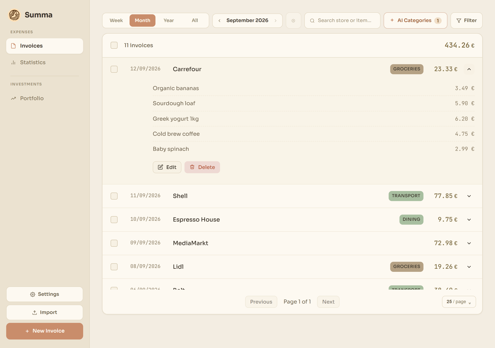
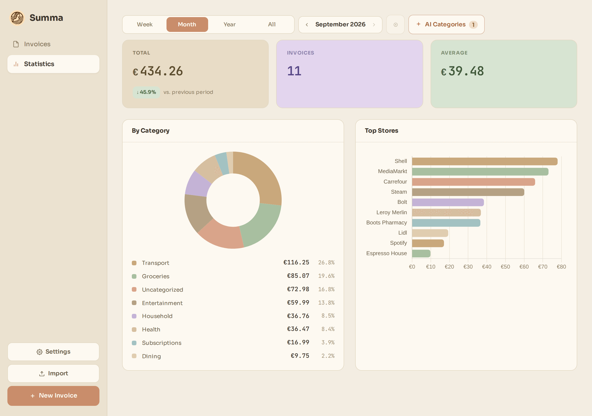
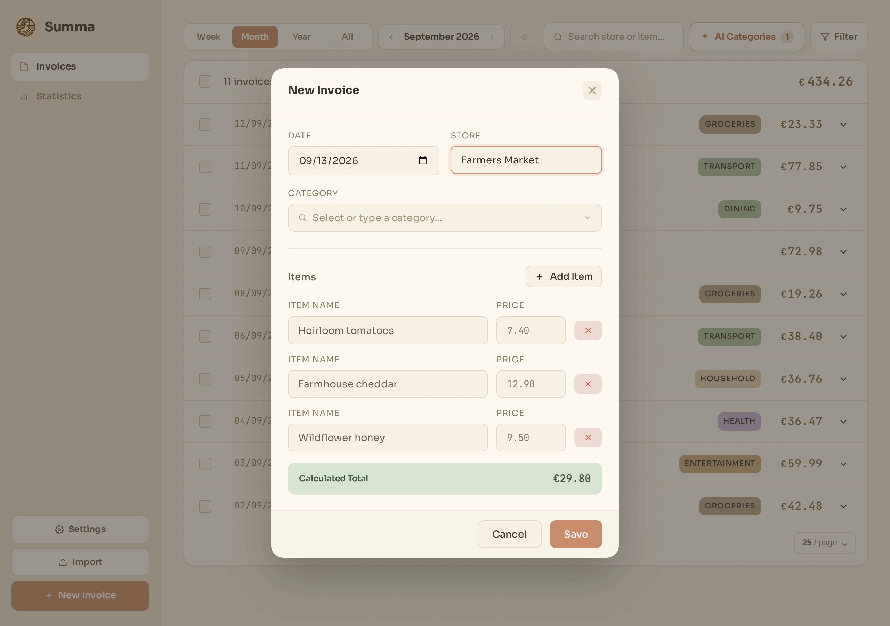
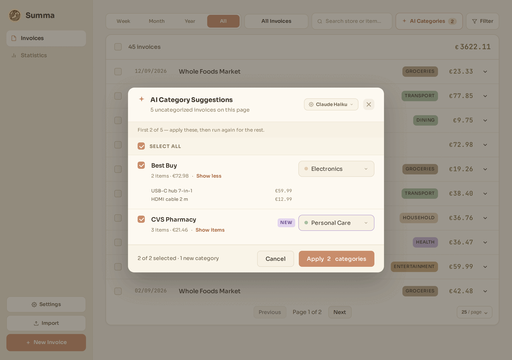
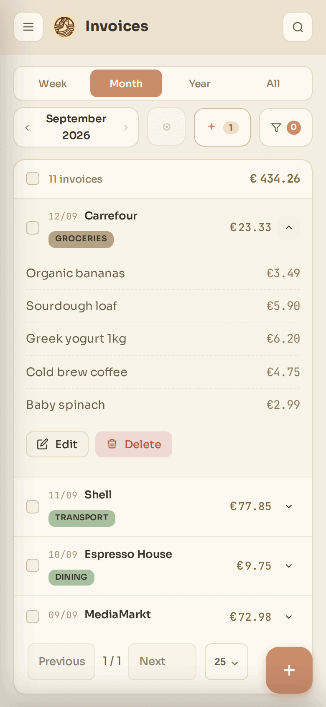
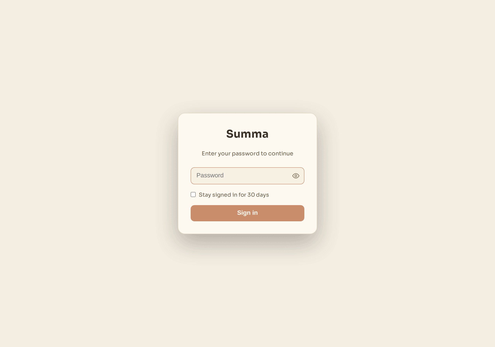
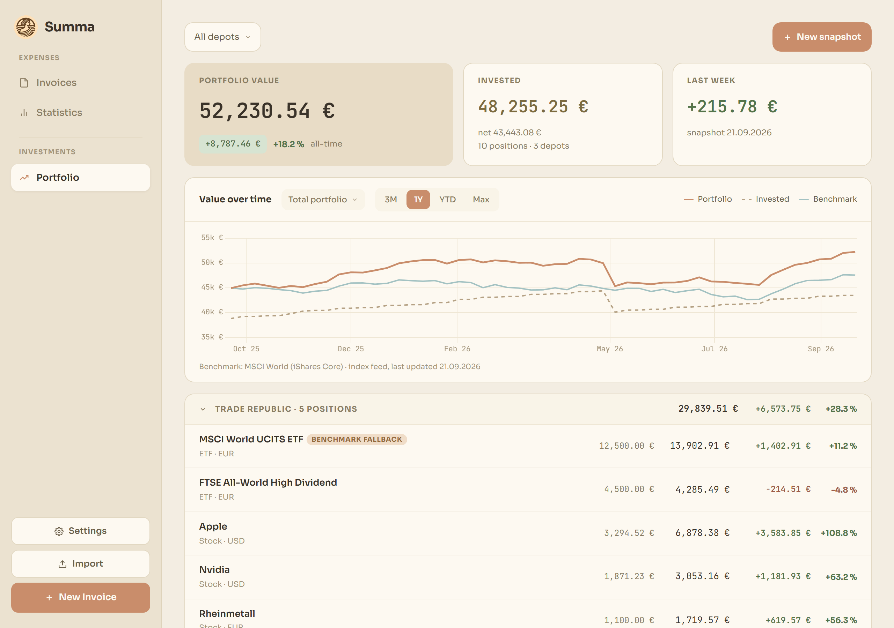
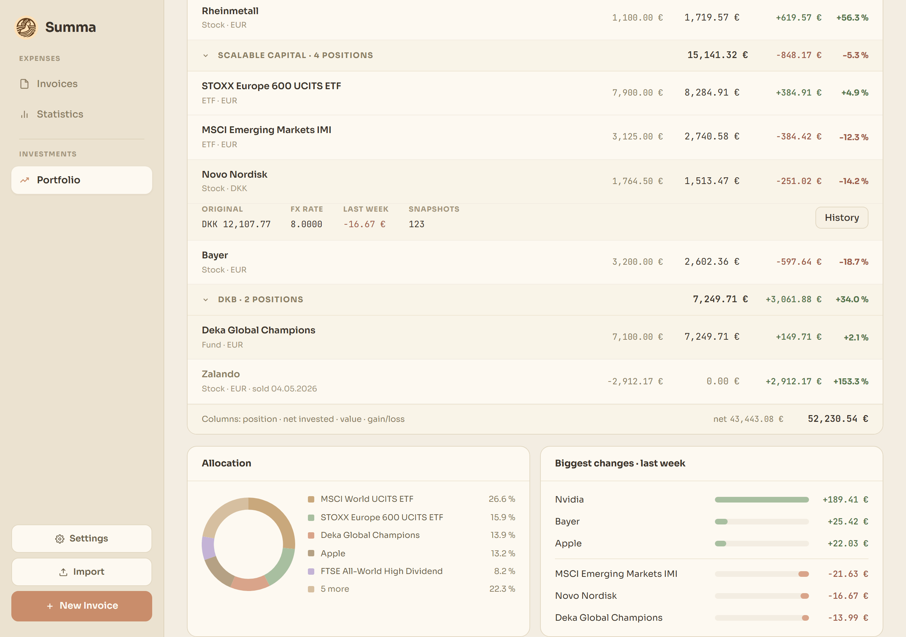
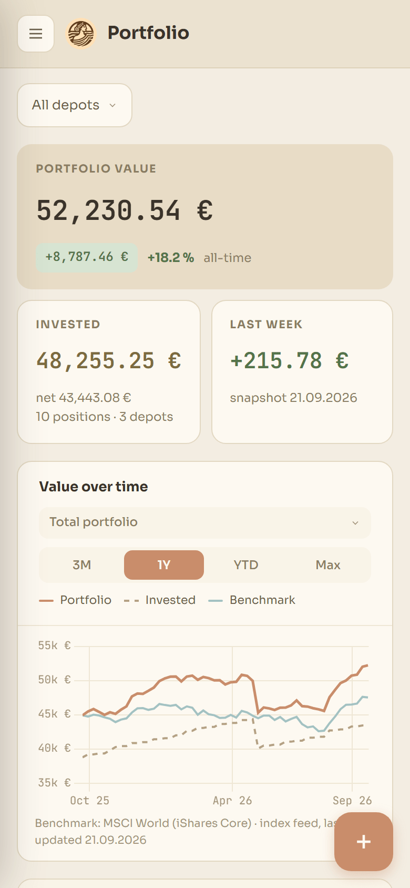
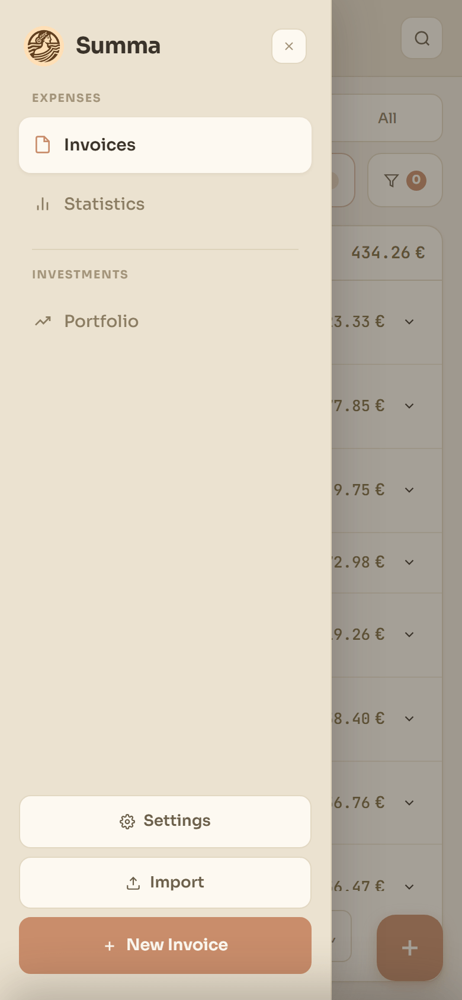

# Summa

Invoice management and expense tracking web application.

## Screenshots

|                                                                               |                                                                                  |
| ----------------------------------------------------------------------------- | -------------------------------------------------------------------------------- |
|            |                                 |
| The invoice list with a row expanded to its line items.                       | Statistics for the period, with per-category and per-store breakdowns.           |
|                |  |
| Creating an invoice with its line items.                                      | Reviewing AI category suggestions before applying them.                          |
|  |                                      |
| The same list as an installed PWA on a phone.                                 | The optional password gate.                                                      |
|                  |     |
| Depot value over time, against the benchmark.                                 | Positions, allocation and the biggest movers of the week.                        |
|                 |                          |
| The portfolio at phone width, with its snapshot FAB.                          | The navigation drawer on a phone.                                                |

The full set lives in [`docs/screenshots/`](docs/screenshots/), which also
documents how to regenerate it.

## Requirements

- Python 3.12+
- [uv](https://docs.astral.sh/uv/) (for local development)
- Docker (optional)

## Quick Start

### Docker (Recommended)

```bash
docker compose up -d
```

The application runs at `http://localhost:8000`. Data is persisted in the
bind-mounted `./data` directory next to the compose file.

See [`docker-compose.yml`](docker-compose.yml) for the full configuration.

### Production Deployment

The app (both the dev server and gunicorn) serves **plain HTTP only** and performs
no TLS termination. For any deployment beyond `localhost`, run it **behind a
TLS-terminating reverse proxy** so traffic — which includes all of your financial
data — is encrypted in transit. Do not publish port `8000` directly to an untrusted
network without such a proxy in front.

Example nginx server block terminating TLS and forwarding to the container:

```nginx
server {
    listen 443 ssl;
    server_name summa.example.com;

    ssl_certificate     /etc/letsencrypt/live/summa.example.com/fullchain.pem;
    ssl_certificate_key /etc/letsencrypt/live/summa.example.com/privkey.pem;

    location / {
        proxy_pass http://127.0.0.1:8000;
        proxy_set_header Host              $host;
        proxy_set_header X-Forwarded-For   $proxy_add_x_forwarded_for;
        proxy_set_header X-Forwarded-Proto $scheme;
    }
}
```

Certificates come from certbot/ACME (Let's Encrypt) or your own CA. Bind the
container's published port to `127.0.0.1:8000:8000` so only the proxy can reach it.

Cross-origin browser access is **denied by default** — the PWA is served
same-origin and needs no CORS. To allow other origins (e.g. a native mobile
client), set `CORS_ALLOWED_ORIGINS` (see [Configuration](#configuration)).

A cross-origin client that has to log in needs three things beyond that, because a
session cookie is only sent cross-site under strict conditions:

- an **explicit** origin list, not `*` — credentialed requests are only allowed
  against named origins, since with the wildcard any site could read your data using
  the visitor's cookie;
- `COOKIE_SAMESITE=none`, as the default `lax` cookie is not sent cross-site at all;
- HTTPS with `COOKIE_SECURE=1`, which browsers require for a `SameSite=None` cookie.

`none` gives up the only CSRF defense this app has — there is no CSRF token — so
any page can then make the visitor's browser send an authenticated cross-site
request. What that reaches is one endpoint: `POST /api/auth/logout` takes no body,
so an attacker page can log the session out. Every other write either requires a
JSON body (a cross-site form POST can't send one, and is answered 415) or uses
`PUT`/`DELETE`, which browsers preflight and the origin allowlist then rejects.

A native client that manages the session token itself is unaffected by all three.

### Local Development

```bash
# Install dependencies (creates .venv automatically)
uv sync

# Create the local environment file (required, see below)
cp .env.example .env

# Run the application
uv run --env-file .env flask --app summa.wsgi run --port 8000
```

The application runs at `http://localhost:8000` with the database stored in `invoices.db`.

The VS Code task **Run: Start Server** starts the same server and loads `.env` the same
way, so the settings there — including whether the
[login gate](#password-protection) is active — apply to the dev server too. On a fresh
clone the file does not exist yet and the task aborts with
``error: No environment file found at: `.env` ``; the `cp` above is the fix. When testing the
login over plain HTTP, `COOKIE_SECURE=0` is what makes the session cookie survive.

### Linting, Formatting & Type Checking

[ruff](https://docs.astral.sh/ruff/) is used for formatting and linting, and
[mypy](https://mypy-lang.org/) for static type checking:

```bash
uv run ruff format .   # format
uv run ruff check .    # lint
uv run mypy            # type check (files are configured in pyproject.toml)
```

## CI & Supply-Chain Security

The [`docker` workflow](.github/workflows/docker.yml) builds the image and runs two supply-chain checks against it before publishing:

- **Vulnerability scan & gate** — a single [`grype`](https://github.com/anchore/grype) run scans the image and emits three outputs from one pass: a full-inventory **table** in the job log (every finding with its _fixed in_ column — the place to look when a critical blocks the push), a **JSON** report, and a **SARIF** report. A following step **fails the build on any _fixable_ critical CVE**, deciding from the JSON's machine-readable `fix.state` field (grype's SARIF has no such field). Gating only on findings that have a released fix keeps the pipeline actionable: a critical CVE with no upstream fix (common for base-image OS packages Debian marks _won't fix_) can't be remediated by a rebuild, so it must not block the push indefinitely — the gate re-activates automatically once a fix ships.
- **Scan visibility** — the full SARIF report is uploaded via `github/codeql-action/upload-sarif`, so findings appear under **Security → Code scanning** and as annotations on pull requests. Because the SARIF is the full inventory, the Security tab lists unfixable criticals too; only the push gate is limited to fixable ones.
- **SBOM** — the published image carries an SPDX SBOM attached as an OCI attestation (`sbom: true` on the build-and-push step), so the bill of materials ships with the image rather than as a throwaway job artifact. Inspect it with `docker buildx imagetools inspect <user>/summa:latest --format '{{ json .SBOM }}'`.

Two operational caveats:

- **Pull requests from forks cannot upload SARIF.** GitHub grants fork PRs only a read-only token, so `upload-sarif` (which needs `security-events: write`) fails on them. The scan and its critical-CVE gate still run — only the Security-tab upload is skipped. Same-repo PRs are unaffected.
- **Code scanning must be enabled** for the repository, otherwise the SARIF upload succeeds but no alerts are surfaced. It is free on public repositories; private repositories require GitHub Advanced Security.
- **Pull-request findings are filtered by branch.** The **Security → Code scanning** view defaults to the default branch (`main`); a scan that ran on a PR only appears after switching the **Branch** filter to that PR's branch (or via the PR's own file annotations).

## AI Category Suggestions

Summa can suggest a spending category for uncategorized invoices using Claude.
From the categorize dialog you trigger a run over the uncategorized invoices on
the current page; the model returns one category per invoice and you review
and confirm the suggestions before anything is written — the request itself never
mutates your data. Because a run is page-scoped, the dialog also says how many
uncategorized invoices the rest of the filtered set still holds, so a
multi-page backlog is visible rather than silently left behind.

**Enabling it:** set `ANTHROPIC_API_KEY` in the server environment (get a key from
the [Anthropic Console](https://console.anthropic.com/)). Locally, copy
[`.env.example`](.env.example) to `.env` and fill it in; for Docker the
`env_file` in [`docker-compose.yml`](docker-compose.yml) picks the same `.env` up.
If `ENABLE_AI_SUGGESTIONS` is missing, the feature is disabled by default. Set
`ENABLE_AI_SUGGESTIONS=1` to enable it; set `0` to hard-disable it and hide the
trigger entirely. With the master switch enabled but no API key configured, the
trigger still renders and the endpoint returns `503`.

The model — Claude Haiku, Sonnet, or Opus — is chosen in the UI (default: Haiku)
and remembered per browser, so it is **not** an environment variable.

## Password Protection

Summa can put a single-password gate in front of the whole deployment. There are
no accounts and no roles — one password lets you in, and a signed `HttpOnly`
cookie keeps you in. It is meant for "keep the public internet out" on a
self-hosted instance, not for telling users apart.

It is **off by default**, so an existing deployment keeps working unchanged.

**Enabling it**

1. Generate a password hash — the app never accepts a plaintext password:

   ```bash
   uv run python -m summa.hashpw
   ```

2. Generate a signing secret:

   ```bash
   uv run python -c "import secrets; print(secrets.token_urlsafe(32))"
   ```

3. Put both in `.env` alongside `AUTH_ENABLED=1`, and set `COOKIE_SECURE=0` if
   you are testing over plain HTTP. See [`.env.example`](.env.example). The local dev
   server reads the same file, so this also gates
   [local runs](#local-development) — flip `AUTH_ENABLED` back to `0` to work ungated.

Everything needed to render the login screen — `/` and `/static/` — stays public;
every other route answers `401` without a session. Wrong passwords are throttled
per client (ten failures per five minutes).

**Limitations, so you can decide consciously:**

- **No individual revocation.** Sessions are stateless signed cookies, so
  "sign out everywhere" means rotating `SESSION_SECRET`, which signs everyone
  out including you.
- **No sliding renewal.** With "Stay signed in", the session ends `SESSION_DAYS`
  after login regardless of activity.
- **Throttling is per process.** The default `gunicorn --workers 2` gives each
  worker its own counter, so the effective allowance is doubled.
- **Throttling needs the real client IP.** Behind a reverse proxy every request
  appears to come from the proxy, collapsing all clients into one bucket. Fixing
  that requires `ProxyFix` and a trusted-proxy list, which Summa does not
  currently configure.
- **The password hash has to be quoted.** Both Docker Compose and
  `uv run --env-file` read `.env` with dotenv rules, where an unquoted `$` is a
  variable reference — and a hash contains two of them. Single-quote the value as
  [`.env.example`](.env.example) shows; verify with
  `docker exec summa printenv AUTH_PASSWORD_HASH`, which must print the hash with
  both `$` intact and no surrounding quotes. If a mangled hash does reach the app
  it logs `AUTH_PASSWORD_HASH is not a readable hash` at startup, so it shows up
  in the container log rather than only as a login that never works.

## Portfolio Import

Depot history is loaded from a workbook by `scripts/import_portfolio_xlsx.py`. It
does **not** run inside the container: the image ships neither the importer nor
`openpyxl` (a dev-only dependency). Run it from a local checkout against the
production database file instead — no checkout is needed on the server. Below,
`<host>` is the server and `<deploy-dir>` the directory holding its
`docker-compose.yml`:

```bash
# Stop every service — the app and the benchmark refresh both write to the
# database — so nothing writes concurrently and the WAL is checkpointed
ssh <host> 'cd <deploy-dir> && docker compose stop'
scp <host>:<deploy-dir>/data/invoices.db ./prod.db
cp prod.db prod.db.bak

uv sync
uv run python -m scripts.import_portfolio_xlsx portfolio.xlsx --db prod.db --dry-run
uv run python -m scripts.import_portfolio_xlsx portfolio.xlsx --db prod.db

scp prod.db <host>:<deploy-dir>/data/invoices.db
ssh <host> 'cd <deploy-dir> && docker compose start'
```

Before copying the file back, make sure no `invoices.db-wal` / `invoices.db-shm`
is left next to it on the server — SQLite would replay a stale WAL onto the
replaced database. File ownership needs no fixing: the entrypoint re-owns `/data`
on every start.

- `--fx CODE=RATE` sets the rate for each foreign-currency position, in units of
  that currency per EUR (e.g. `--fx USD=1.08`); a currency without one is stored
  at `1.0`.
- `--sheet NAME` picks the worksheet (default `Übersicht`).
- Re-running is safe: a week already in the database is kept as it is, so values
  corrected in the UI survive a later import.

The benchmark line in the chart is refreshed by `scripts/fetch_benchmark.py`,
which, unlike the importer, ships in the image: the `benchmark` service in
[`docker-compose.yml`](docker-compose.yml) runs it once a day from an image built from the same Dockerfile
(`BENCHMARK_INTERVAL_SECONDS` overrides that, down to a floor of one hour) for the symbol in
`BENCHMARK_SYMBOL`, writing to the same `./data` database while the app keeps
running — which is why the import above stops it along with the app. A deployment with its own compose file copies that service block,
swapping `build: .` for the `image:` it pulls. Check a run with
`docker compose logs benchmark`; a failed fetch is retried after an hour rather than
waiting out the full interval, and until one succeeds the chart falls back and
says so in its footnote.

## Configuration

Copy [`.env.example`](.env.example) to `.env` and fill in the values you need. The
copy is required for local development — the dev server and the VS Code task read it
via `uv run --env-file .env`.

| Environment Variable    | Default       | Description                                                                                                                                                                                                    |
| ----------------------- | ------------- | -------------------------------------------------------------------------------------------------------------------------------------------------------------------------------------------------------------- |
| `ANTHROPIC_API_KEY`     | _(unset)_     | Configures [AI category suggestions](#ai-category-suggestions). Required for requests once the master switch is enabled.                                                                                       |
| `ENABLE_AI_SUGGESTIONS` | _(unset)_     | Master switch for AI category suggestions. Unset/`0` disables the feature; set to `1` to show the trigger and allow requests.                                                                                  |
| `DATABASE_PATH`         | `invoices.db` | Path to SQLite database                                                                                                                                                                                        |
| `CORS_ALLOWED_ORIGINS`  | _(empty)_     | Cross-origin allowlist — a comma-separated list of origins, or `*` for the wildcard. Empty = same-origin only. A named list also permits credentialed (cookie-bearing) requests; `*` does not.                 |
| `FLASK_DEBUG`           | `0` (off)     | Set to `1` to enable the Flask/Werkzeug debugger on the dev server. Never enable in production — it allows RCE.                                                                                                |
| `AUTH_ENABLED`          | `0` (off)     | Master switch for [password protection](#password-protection). Unset/`0` leaves the app open to anyone who can reach it.                                                                                       |
| `AUTH_PASSWORD_HASH`    | _(unset)_     | Hash of the login password, from `uv run python -m summa.hashpw`. Without it nobody can log in — the gate fails closed.                                                                                        |
| `SESSION_SECRET`        | _(unset)_     | Key used to sign the session cookie. Required once the gate is on; otherwise sessions die on every restart and per worker.                                                                                     |
| `SESSION_DAYS`          | `30`          | How long "Stay signed in" keeps a session alive, in days (`1`–`3650`). The login screen states the configured value. Anything unparseable or out of range falls back to `30`.                                  |
| `COOKIE_SECURE`         | `1` (on)      | `Secure` flag on the session cookie. Set to `0` for plain-HTTP testing — a Secure cookie is dropped over `http://`.                                                                                            |
| `COOKIE_SAMESITE`       | `lax`         | `SameSite` flag on the session cookie. `lax` is what defends against CSRF here; there is no CSRF token. A cross-site browser client needs `none` (which browsers only accept together with `COOKIE_SECURE=1`). |

## API

The application provides REST endpoints at `/api/invoices` for managing invoice data.
